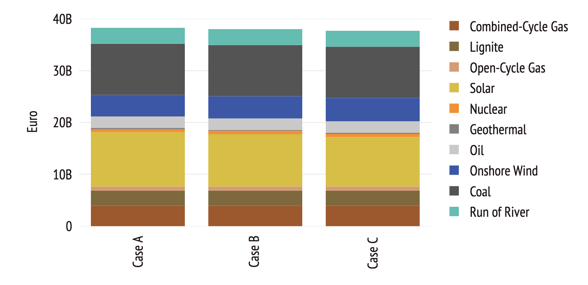
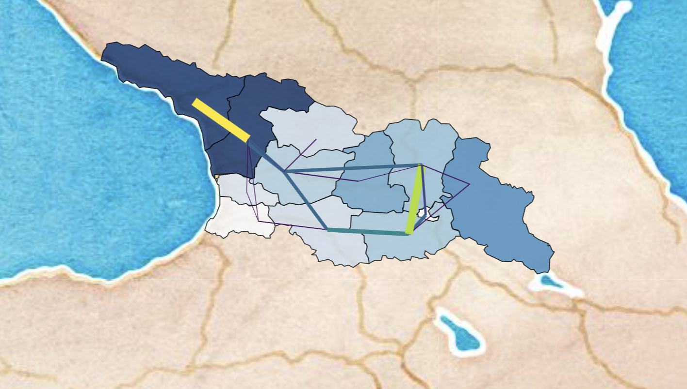
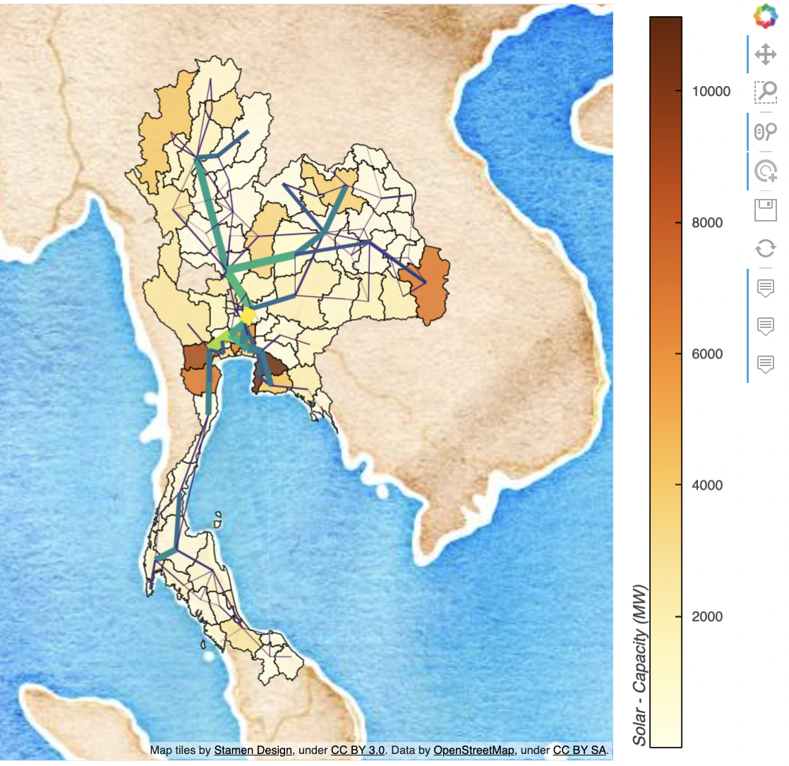
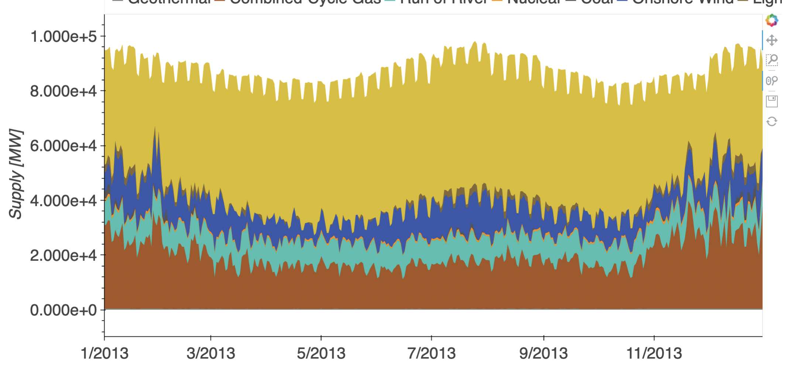
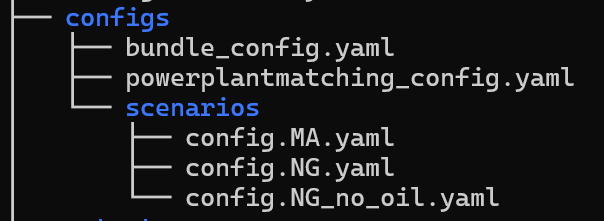
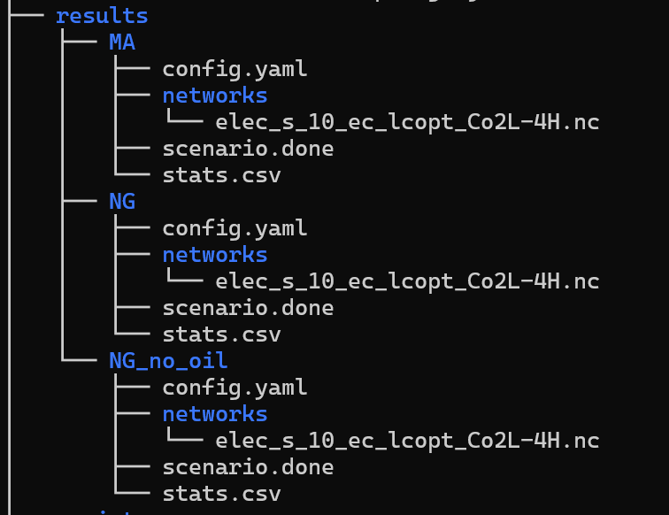
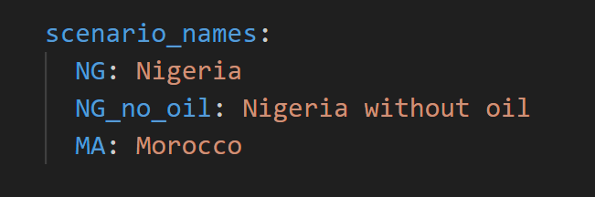

# PyPSA-Earth-Lit

Testing streamlit module that works along a stable pypsa-earth package version

Visit the hosted version of the application at [https://tauritron.com/](https://tauritron.com/)

Refer to the documentation for information about contributions and further understanding: [https://main--comforting-madeleine-30be5f.netlify.app/](https://docs.tauritron.com/](https://main--comforting-madeleine-30be5f.netlify.app/)

## Folder Structure

**pypsa-earth-lit** is designed to seamlessly integrate with existing **pypsa-earth** projects. To set up, simply place the **pypsa-earth-lit** folder as a sibling directory to your solved **pypsa-earth** project. This smart integration enables **pypsa-earth-lit** to automatically extract the necessary files required for plotting purposes.

By following this straight forward setup, you can effortlessly leverage **pypsa-earth-lit** to generate insightful visualizations using the relevant data extracted from your **pypsa-earth** project.

Feel free to explore and contribute to **pypsa-earth-lit** as it enhances the plotting capabilities of your **pypsa-earth** endeavors.


**note** - the pypsa-earth folder path is defined in pypsa-earth-lit [config.yaml](#config-yaml) file under `data_dir` and can be changed to any other path.

## Getting Started

To begin using this application, we have precompiled a solved **pypsa-earth** project for your convenience. Follow the steps below to retrieve a sample **pypsa-earth** directory and set up the necessary environment to run **pypsa-earth-lit**.

Depending on what you need, recommended order.

```console
mkdir tauritron-project
cd tauritron-project
git clone https://github.com/pypsa-meets-earth/pypsa-earth-lit.git
```

```console
make -f ./pypsa-earth-lit/Makefile get_data
conda env create -f ./pypsa-earth-lit/env.yaml
conda activate pypsa-earth-lit
cd pypsa-earth-lit
pip install -e .
make -f ./Makefile run_app
```

## Result Preview

Here's a glimpse of the exciting results you can expect while using **pypsa-earth-lit** to enhance your **pypsa-earth** projects:


&nbsp;


&nbsp;


&nbsp;


&nbsp;



These visuals showcase just a fraction of the insightful plots and analyses you can generate using **pypsa-earth-lit**. Dive into your data and uncover valuable insights with ease.

## Using Your Own PyPSA-Earth

If you are new to **PyPSA-Earth**, it is recommended to follow the [tutorial](https://pypsa-earth.readthedocs.io/en/latest/short_tutorial.html) before proceeding with the steps outlined below. Familiarity with **PyPSA-Earth** will enhance your understanding of the following instructions.

In contrast to the `solve_all_networks` command that uses the default configuration present in the **PyPSA-Earth** root directory, we will be employing a different command: `snakemake -j1 run_all_scenarios`. This command leverages multiple configurations located in `pypsa-earth/configs/scenarios`.

**Custom Configurations for Scenarios**</br>

For each scenario, you have the flexibility to define a unique configuration file in the form `config.scenario_name.yaml`. These custom configurations allow you to tailor the parameters and settings specific to each scenario, optimizing the analysis for your project's requirements.

Executing the command `snakemake -j1 run_all_scenarios` triggers **PyPSA-Earth** to process the defined scenarios using their respective configurations. The output is a collection of folders inside the `results` directory, each corresponding to a scenario. These folders contain essential data and results produced by **PyPSA-Earth**.



The generated folders within the `results` directory, along with other relevant data from **PyPSA-Earth**, serve as the foundation for the **PyPSA-Earth-Lit** application. **PyPSA-Earth-Lit** seamlessly integrates this data, enabling you to visualize, analyze, and interact with scenario-specific insights through informative plots and visualizations.

Refer to the attached images and the solved **PyPSA-Earth** project in this repository for a clearer understanding of the structure and output.

## Final Step: Connecting PyPSA-Earth-Lit to PyPSA-Earth

We are now at the threshold of unlocking the power of insightful visualizations using **PyPSA-Earth-Lit**. Before diving into the world of awesome graphs, there is one final step that bridges the gap between your **PyPSA-Earth** scenarios and the **PyPSA-Earth-Lit** application.



### Adding Scenario Names to `config.yaml`

1. Navigate to the `config.yaml` file within the `pypsa-earth-lit/pages/utils/` directory.

2. In the `config.yaml` file, locate the section under `scenario_names`. Here, you will find predefined test scenario names.

3. Add your resulting scenario names to this section, providing user-friendly names for each scenario. This crucial step establishes the connection between **PyPSA-Earth-Lit** and your **PyPSA-Earth** scenarios.

By adding scenario names and corresponding user-friendly names to the `config.yaml` file, you enable **PyPSA-Earth-Lit** to seamlessly access and visualize the data generated by your **PyPSA-Earth** project.

### Visualizing Awesome Graphs

With the scenario names linked in the `config.yaml` file, you are now ready to immerse yourself in the world of awesome graphs and visualizations.Navigate to **PyPSA-Earth-Lit** application, launch it by executing the following commands in your terminal:
```console- make -f ./Makefile run_app```

explore the insights offered by your **PyPSA-Earth** scenarios.

Your path to insights is complete. Congratulations on connecting the dots between **PyPSA-Earth** and **PyPSA-Earth-Lit** !!!

## Contributors

<!-- https://github.com/marketplace/actions/contribute-list -->

<!-- readme: collaborators,contributors,restyled-commits/- -start -->
<table>
<tr>
    <td align="center">
        <a href="https://github.com/pz-max">
            
            <br />
            <sub><b>Max Parzen</b></sub>
        </a>
    </td>
    <td align="center">
        <a href="https://github.com/akshat089">
            
            <br />
            <sub><b>Akshat Mittal</b></sub>
        </a>
    </td>
    <td align="center">
        <a href="https://github.com/ekatef">
            
            <br />
            <sub><b>Ekaterina</b></sub>
        </a>
    </td>
</tr>
</table>
<!-- readme: collaborators,contributors,restyled-commits/- -end -->
