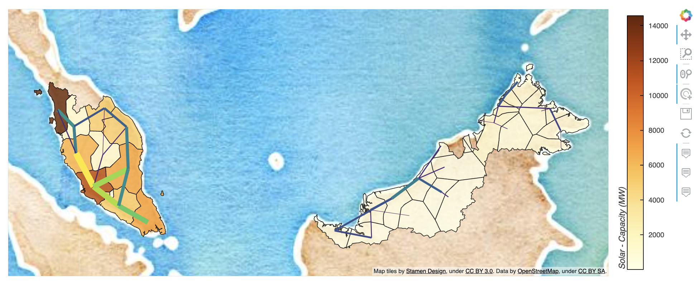

# PyPSA-Earth-Lit

Testing streamlit module that works along a stable pypsa-earth package version

## Folder Structure

**pypsa-earth-lit** is designed to seamlessly integrate with existing **pypsa-earth** projects. To set up, simply place the **pypsa-earth-lit** folder as a sibling directory to your solved **pypsa-earth** project. This smart integration enables **pypsa-earth-lit** to automatically extract the necessary files required for plotting purposes.

By following this straight forward setup, you can effortlessly leverage **pypsa-earth-lit** to generate insightful visualizations using the relevant data extracted from your **pypsa-earth** project.

Feel free to explore and contribute to **pypsa-earth-lit** as it enhances the plotting capabilities of your **pypsa-earth** endeavors.


**note** - the pypsa-earth folder path is defined in pypsa-earth-lit [config.yaml](#config-yaml) file under `data_dir` and can be changed to any other path.

## Getting Started

To begin using this application, we have precompiled a solved **pypsa-earth** project for your convenience. Follow the steps below to retrieve a sample **pypsa-earth** directory and set up the necessary environment to run **pypsa-earth-lit**.

Depending on what you need, recommended order.

```console
- mkdir tauritron-project
- cd tauritron-project
- git clone https://github.com/pypsa-meets-earth/pypsa-earth-lit.git
```

```console
- make -f ./pypsa-earth-lit/Makefile get_data
- conda env create -f ./pypsa-earth-lit/env.yaml
- conda activate pypsa-earth-lit
- cd pypsa-earth-lit
- pip install -e .
- make -f ./Makefile run_app
```

## Result Preview

Here's a glimpse of the exciting results you can expect while using **pypsa-earth-lit** to enhance your **pypsa-earth** projects:


&nbsp;


&nbsp;


&nbsp;


&nbsp;


These visuals showcase just a fraction of the insightful plots and analyses you can generate using **pypsa-earth-lit**. Dive into your data and uncover valuable insights with ease.

## Using Your Own PyPSA-Earth

If you are new to **PyPSA-Earth**, it is recommended to follow the [tutorial](https://pypsa-earth.readthedocs.io/en/latest/short_tutorial.html) before proceeding with the steps outlined below. Familiarity with **PyPSA-Earth** will enhance your understanding of the following instructions.

In contrast to the `solve_all_networks` command that uses the default configuration present in the **PyPSA-Earth** root directory, we will be employing a different command: `snakemake -j1 run_all_scenarios`. This command leverages multiple configurations located in `pypsa-earth/configs/scenarios`.

**Custom Configurations for Scenarios**</br>

For each scenario, you have the flexibility to define a unique configuration file in the form `config.scenario_name.yaml`. These custom configurations allow you to tailor the parameters and settings specific to each scenario, optimizing the analysis for your project's requirements.

Executing the command `snakemake -j1 run_all_scenarios` triggers **PyPSA-Earth** to process the defined scenarios using their respective configurations. The output is a collection of folders inside the `results` directory, each corresponding to a scenario. These folders contain essential data and results produced by **PyPSA-Earth**.


The generated folders within the `results` directory, along with other relevant data from **PyPSA-Earth**, serve as the foundation for the **PyPSA-Earth-Lit** application. **PyPSA-Earth-Lit** seamlessly integrates this data, enabling you to visualize, analyze, and interact with scenario-specific insights through informative plots and visualizations.

Refer to the attached images and the solved **PyPSA-Earth** project in this repository for a clearer understanding of the structure and output.

## Final Step: Connecting PyPSA-Earth-Lit to PyPSA-Earth

We are now at the threshold of unlocking the power of insightful visualizations using **PyPSA-Earth-Lit**. Before diving into the world of awesome graphs, there is one final step that bridges the gap between your **PyPSA-Earth** scenarios and the **PyPSA-Earth-Lit** application.


### Adding Scenario Names to `config.yaml`

1. Navigate to the `config.yaml` file within the `pypsa-earth-lit/pages/utils/` directory.

2. In the `config.yaml` file, locate the section under `scenario_names`. Here, you will find predefined test scenario names.

3. Add your resulting scenario names to this section, providing user-friendly names for each scenario. This crucial step establishes the connection between **PyPSA-Earth-Lit** and your **PyPSA-Earth** scenarios.

By adding scenario names and corresponding user-friendly names to the `config.yaml` file, you enable **PyPSA-Earth-Lit** to seamlessly access and visualize the data generated by your **PyPSA-Earth** project.

### Visualizing Awesome Graphs

With the scenario names linked in the `config.yaml` file, you are now ready to immerse yourself in the world of awesome graphs and visualizations.Navigate to **PyPSA-Earth-Lit** application, launch it by executing the following commands in your terminal:
```console- make -f ./Makefile run_app```

explore the insights offered by your **PyPSA-Earth** scenarios.

Your path to insights is complete. Congratulations on connecting the dots between **PyPSA-Earth** and **PyPSA-Earth-Lit** !!!

## Application Architecture


In the root directory of this project, you will find the following essential files:

### `env.yaml`

The `env.yaml` file contains a list of project dependencies that are used to create a Conda environment. You can use this file to ensure that you have all the necessary dependencies installed for smooth execution of the project.

### `Makefile`

The `Makefile` is a convenient resource that is particularly related to testing and setup. Using the commands defined in the Makefile, you can streamline your testing processes and set up the project environment efficiently.

### `setup.py`

The `setup.py` file is crucial for making Python module imports possible internally within the project. It helps organize your codebase into manageable modules, making it easier to maintain and develop.

By utilizing `setup.py`, you ensure that your project's modules are accessible and structured correctly.

### app

The `app` directory houses the core components of the multipage Streamlit application. The following elements contribute to the structure and functionality of the application:

`index.py`

The `index.py` file serves as the entry point of the [Streamlit multipage application](https://docs.streamlit.io/library/get-started/multipage-apps).

### `app/pages`

Inside the `pages` folder, you will find a collection of files that correspond to individual pages of the [Streamlit multipage application.](https://docs.streamlit.io/library/get-started/multipage-apps) Each file represents a distinct section or functionality of the application.

### `app/pages/utils`

#### `__pre_run.py`

In the context of this project, each file within the `pages` folder has a corresponding `pre_run` file.

The `pre_run` files serve as preparatory scripts that are executed prior to the main execution of each page in the Streamlit multipage application. Their primary objectives include:

1. **Data Modification and Processing:** After extraction, the data is subjected to various processing steps, where it is modified, cleaned, and structured in a way that is conducive to effective visualization.

2. **Caching:** One of the key optimizations introduced by the `pre_run` files is caching. Processed data is cached, allowing subsequent runs of the application to reuse the precomputed data. This caching mechanism significantly enhances performance, as it eliminates the need to repeatedly process the same data.

#### `tools.py`

The `tools.py` file is a fundamental component of this project, serving as a data extraction and organization tool. Its primary function is to extract data from the **pypsa-earth** networks and create a dictionary structure that associates scenario names with their respective **pypsa** networks.

The `tools.py` script is designed to streamline the process of working with different scenarios within the **pypsa-earth** framework.

#### <a name="config-yaml">`config.yaml`</a>

The `config.yaml` file encompasses the following important configurations:

1. **Color Schemes:** `config.yaml` defines color schemes that are utilized throughout the application's visual elements. These color schemes contribute to a consistent and visually appealing design, making it easier for users to interpret and engage with the content.

2. **User-Friendly Names:** One of the significant features of `config.yaml` is the inclusion of user-friendly names for scenarios and other internal data elements. These meaningful names enhance user interaction and understanding, allowing users to easily identify and select different options.

3. **Units for Plots:** The `config.yaml` file also specifies units that are associated with various parameters used in plots and visualizations. These units not only aid users in comprehending the displayed information but also provide a clear reference to the original data in the **pypsa-earth** networks.

4. **Parameter Tracking:** By defining units and providing comprehensive information, `config.yaml` aids in tracking which parameters are being utilized from the **pypsa-earth** networks.
